<picture>
  <source media="(prefers-color-scheme: dark)" srcset="assets/banner/dark.svg" />
  <source media="(prefers-color-scheme: light)" srcset="assets/banner/light.svg" />
  
</picture>

  
  &nbsp;
  
  &nbsp;
  

<picture>
  <source media="(prefers-color-scheme: dark)" srcset="https://raw.githubusercontent.com/JuanVelasco-tsx/JuanVelasco-tsx/projects/header-proyectos-dark.svg" />
  <source media="(prefers-color-scheme: light)" srcset="https://raw.githubusercontent.com/JuanVelasco-tsx/JuanVelasco-tsx/projects/header-proyectos-light.svg" />
  
</picture>

<a href="https://github.com/yuseth289/front-neo">
<picture>
  <source media="(prefers-color-scheme: dark)" srcset="https://raw.githubusercontent.com/JuanVelasco-tsx/JuanVelasco-tsx/projects/card-neogaming-dark.svg" />
  <source media="(prefers-color-scheme: light)" srcset="https://raw.githubusercontent.com/JuanVelasco-tsx/JuanVelasco-tsx/projects/card-neogaming-light.svg" />
  
</picture>
</a>

Ver detalle

Proyecto formativo del SENA en equipo de 4 desarrolladores con metodología <strong>Scrum</strong> (octubre 2025 – julio 2026). Fundé el repositorio base, definí la estructura inicial y la documentación técnica. La plataforma cuenta con <strong>13 módulos funcionales</strong> (autenticación, carrito, checkout, paneles de administrador y vendedor, chat, reseñas, etc.) y <strong>27 controladores REST</strong>, desplegada en Railway.

<strong>Backend:</strong> Spring Boot 4 · Spring Security · JWT · PostgreSQL · Flyway · OpenAPI/Swagger <strong>Frontend:</strong> Angular 21 (SSR, NgRx) · Tailwind CSS v4

<strong>Liderazgo de QA:</strong> más de 40 incidencias documentadas y priorizadas (Mercado Pago, stock/inventario, panel de administración, catálogo y asistente IA de publicación).

  
  &nbsp;
  

<a href="https://github.com/JuanVelasco-tsx/VersusPrep">
<picture>
  <source media="(prefers-color-scheme: dark)" srcset="https://raw.githubusercontent.com/JuanVelasco-tsx/JuanVelasco-tsx/projects/card-versusprep-dark.svg" />
  <source media="(prefers-color-scheme: light)" srcset="https://raw.githubusercontent.com/JuanVelasco-tsx/JuanVelasco-tsx/projects/card-versusprep-light.svg" />
  
</picture>
</a>

Ver detalle

Aplicación de escritorio personal (2026 – actualidad, versión <strong>1.0.0-beta</strong> publicada para la comunidad). Automatiza la gestión de addons de Steam Workshop para L4D2 en modo Versus, eliminando el proceso manual de extraer y reconstruir VPKs. Interfaz rediseñada para usuarios sin experiencia técnica y firmada digitalmente con signtool (SHA-256 + sellado de tiempo).

  

<a href="https://github.com/JuanVelasco-tsx/Eito-bot-dc">
<picture>
  <source media="(prefers-color-scheme: dark)" srcset="https://raw.githubusercontent.com/JuanVelasco-tsx/JuanVelasco-tsx/projects/card-eito-bot-dark.svg" />
  <source media="(prefers-color-scheme: light)" srcset="https://raw.githubusercontent.com/JuanVelasco-tsx/JuanVelasco-tsx/projects/card-eito-bot-light.svg" />
  
</picture>
</a>

Ver detalle

Bot personal en Python 3.12 + discord.py, desplegado 24/7 en Railway. Moderación (ban, kick, mute, advertencias), sistema de niveles/XP, roles por reacción y creación automática de canales, categorías y roles. Migré la persistencia de JSON a PostgreSQL con SQLAlchemy 2.0 async + asyncpg (multi-servidor, sin pérdida de datos entre redeploys) e implementé RBAC para canales restringidos.

  

<picture>
  <source media="(prefers-color-scheme: dark)" srcset="https://raw.githubusercontent.com/JuanVelasco-tsx/JuanVelasco-tsx/projects/header-actividad-dark.svg" />
  <source media="(prefers-color-scheme: light)" srcset="https://raw.githubusercontent.com/JuanVelasco-tsx/JuanVelasco-tsx/projects/header-actividad-light.svg" />
  
</picture>

<picture>
  <source media="(prefers-color-scheme: dark)"
    srcset="https://raw.githubusercontent.com/JuanVelasco-tsx/JuanVelasco-tsx/output/github-snake-dark.svg" />
  <source media="(prefers-color-scheme: light)"
    srcset="https://raw.githubusercontent.com/JuanVelasco-tsx/JuanVelasco-tsx/output/github-snake.svg" />
  
</picture>

<picture>
  <source media="(prefers-color-scheme: dark)" srcset="https://github-readme-stats-one-phi-25.vercel.app/api?username=JuanVelasco-tsx&show_icons=true&count_private=true&include_all_commits=true&hide_rank=true&hide=stars%2Cissues&hide_border=true&bg_color=0D0818&title_color=A855F7&icon_color=C084FC&text_color=F5F3FF" />
  <source media="(prefers-color-scheme: light)" srcset="https://github-readme-stats-one-phi-25.vercel.app/api?username=JuanVelasco-tsx&show_icons=true&count_private=true&include_all_commits=true&hide_rank=true&hide=stars%2Cissues&hide_border=true&bg_color=FFFFFF&title_color=7E22CE&icon_color=9333EA&text_color=1E1033" />
  
</picture>

